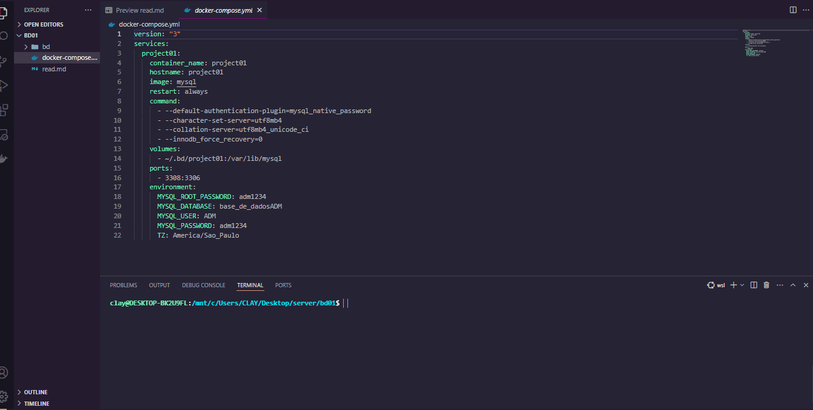

## 👨‍💻PROJETO DOCKER-COMPOSE E MYSQL

<p> Esse arquivo tem como objetivo ser utilizado para banco de dados Mysql.Assim sendo não necessário instalar no ambiente local xamp e wamp server </P>

<h1 align="center">

 

</h1>

### 🎲 usar no terminal docker-compose

```bash
# Clone este repositório
$ docker-compose up -d
$
# verificando docker-compose ativo
$ docker ps
```

### 🛠 Tecnologias

As seguintes ferramentas foram usadas na construção do projeto:

- 

- 

- 


